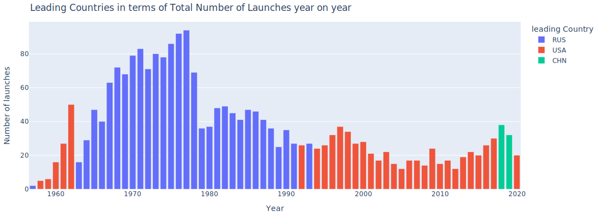
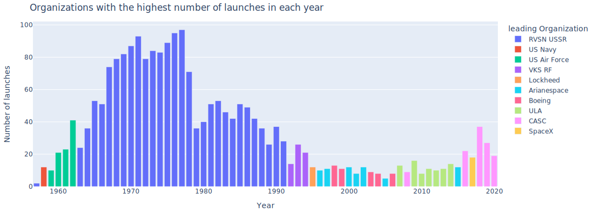

# Introduction

This dataset was scraped from [nextspaceflight.com](https://nextspaceflight.com/launches/past/?page=1) and includes all the space missions since the beginning of Space Race between the USA and the Soviet Union in 1957!

# Race to Space

Used space missions data from nextspaceflight.com between 1957 and 2020 to analyse and visualise trends over time.

## Analysed and Visualise the Space Race

## ✔️ Author

 
  

<b>Yasser Gribi</b> Python developer | Python, Django, Flask.

