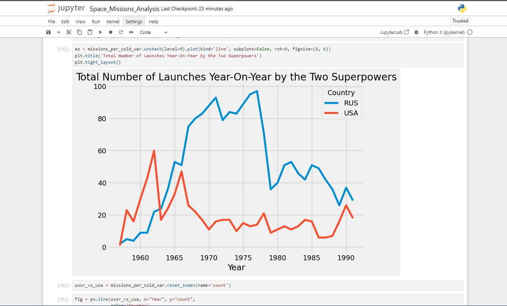
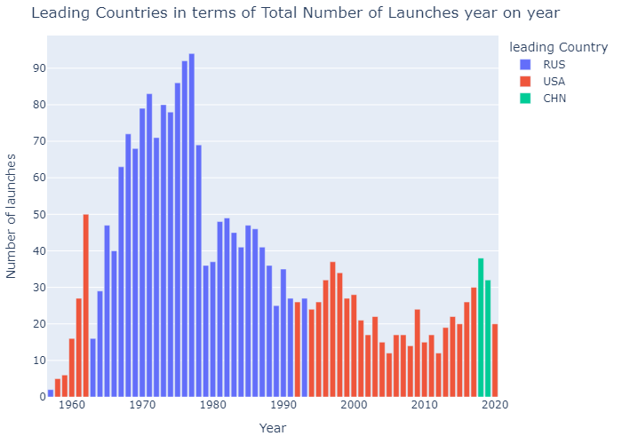
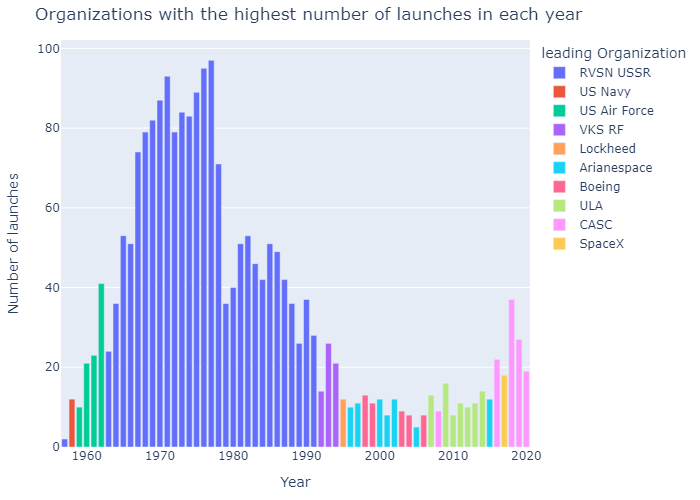

# Race to Space

Used space missions data from nextspaceflight.com between 1957 and 2020 to analyse and visualise trends over time.

## Analysed and Visualise the Space Race

## ✔️ Author

 
  

<b>Yasser Gribi</b> Python developer | Python, Django, Flask.

